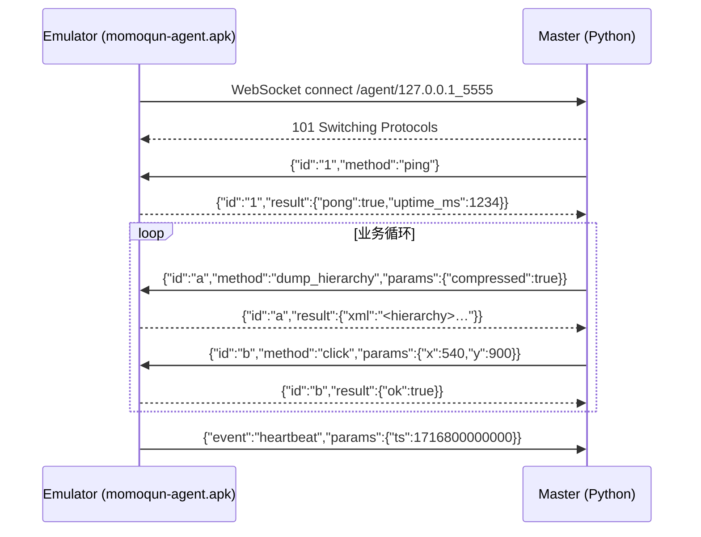

# momoqun Agent Protocol v1.0

> 路线 C 通信协议。冻结字段：Week 1 Day 5。
> 任何不兼容修改必须 bump 主版本号（v1 → v2），并保留 v1 路由 1 个 release。

## 1. 传输

- **协议**：WebSocket，文本帧，UTF-8 JSON。
- **方向**：agent 主动连 master，连接稳定后保持开放。
- **端点**：`ws://<master_host>:<port>/agent/{serial}`
  - `serial`：模拟器序列号，URL-safe（如 `127.0.0.1_5555`）。
  - 同一 serial 重复连接：旧连接被 master 关闭。
- **心跳**：agent 每 10s 发 `{"event": "heartbeat"}`；master 30s 未收到任何帧则关连接。

## 2. 消息形态

JSON-RPC 2.0 子集。三种形态：

### 2.1 master → agent：请求

```json
{ "id": "uuid-hex", "method": "<name>", "params": { ... } }
```

字段：

| 字段 | 类型 | 必填 | 说明 |
|------|------|------|------|
| `id` | string | 是 | master 生成的请求 ID（uuid4 hex） |
| `method` | string | 是 | 见 §3 方法表 |
| `params` | object | 否 | 方法参数；默认 `{}` |

### 2.2 agent → master：响应

成功：
```json
{ "id": "uuid-hex", "result": { ... } }
```
失败：
```json
{ "id": "uuid-hex", "error": { "code": int, "message": "...", "data": any } }
```

### 2.3 agent → master：事件（无 `id`）

```json
{ "event": "<name>", "params": { ... } }
```

| event | 触发 | params |
|-------|------|--------|
| `heartbeat` | 10s 周期 | `{"ts": <epoch_ms>}` |
| `service_revoked` | Accessibility / IME 被关闭 | `{"reason": str}` |
| `low_resource` | RAM 紧张 | `{"avail_mb": int}` |

## 3. 方法表

### 3.1 health

#### `ping`

| 入参 | 出参 |
|------|------|
| `{}` | `{"pong": true, "uptime_ms": int}` |

### 3.2 hierarchy

#### `dump_hierarchy`

| 入参 | 出参 |
|------|------|
| `{"compressed": bool}` | `{"xml": string}` |

- `compressed`：是否使用 AccessibilityNodeInfo 的精简模式（去掉不可见、空文本节点）。
- `xml`：与 `uiautomator2.Device.dump_hierarchy()` 兼容（同一根 `<hierarchy>` 节点，节点属性同名）。

### 3.3 input

#### `click`

| 入参 | 出参 |
|------|------|
| `{"x": int, "y": int}` | `{"ok": true}` |

#### `long_click`

| 入参 | 出参 |
|------|------|
| `{"x": int, "y": int, "duration_ms": int}` | `{"ok": true}` |

#### `swipe`

| 入参 | 出参 |
|------|------|
| `{"x1": int, "y1": int, "x2": int, "y2": int, "duration_ms": int}` | `{"ok": true}` |

#### `press_key`

| 入参 | 出参 |
|------|------|
| `{"key": "back" \| "home" \| "enter" \| "recent" \| "power"}` | `{"ok": true}` |

#### `type_text`

| 入参 | 出参 |
|------|------|
| `{"text": string}` | `{"ok": true}` |

调用前需要 agent 端 momoqun-ime 被设为默认输入法（见 `ime_status`），否则返回 `ERR_NOT_AUTHORIZED`。

### 3.4 screen

#### `window_size`

| 入参 | 出参 |
|------|------|
| `{}` | `{"w": int, "h": int}` |

#### `screenshot`

| 入参 | 出参 |
|------|------|
| `{"quality": int 1-100}` | `{"png_b64": string}` |

### 3.5 status

#### `ime_status`

| 入参 | 出参 |
|------|------|
| `{}` | `{"available": bool, "selected": bool}` |

- `available`：momoqun-ime APK 已安装且 InputMethodService 已注册。
- `selected`：当前系统默认 IME 是 momoqun-ime。

#### `keyboard_visible`

| 入参 | 出参 |
|------|------|
| `{}` | `{"visible": bool}` |

#### `wait_for`

| 入参 | 出参 |
|------|------|
| `{"xpath": string, "timeout_ms": int}` | `{"matched": bool, "node": {…}\|null}` |

可选方法；agent 端用 AccessibilityNodeInfo 直接做 XPath 子集匹配。

## 4. 错误码

| code | 含义 | 何时发生 |
|------|------|----------|
| `-32600` | 协议错误 | 顶层 JSON 缺 `id`/`method`，或 schema 异常 |
| `-32601` | 未知方法 | `method` 不在 §3 表里 |
| `-32602` | 参数非法 | 类型不匹配 / 缺必填 |
| `-32001` | 元素未找到 | 仅 `wait_for` / 解析坐标失败时使用 |
| `-32002` | 操作超时 | RPC 执行超过 master 给的 timeout（agent 侧主动报） |
| `-32003` | 未授权 | Accessibility / IME 未启用 |
| `-32004` | agent 离线 | master 侧合成（agent 不会返回此码） |

## 5. 时序示意



## 6. 兼容性约定

- 字段以**结构**为契约，不依赖键顺序；
- 协议保留 `meta` 顶层字段，agent 可塞自定义诊断信息（master 收到后忽略）；
- 任何 method 的 `result` 对象可追加字段（向后兼容）；删除字段需 bump 版本；
- `error.data` 是字符串/对象皆可，仅供调试，不参与控制流。
